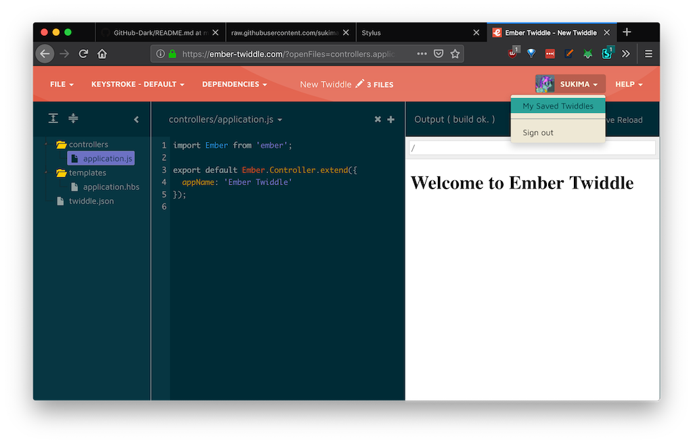
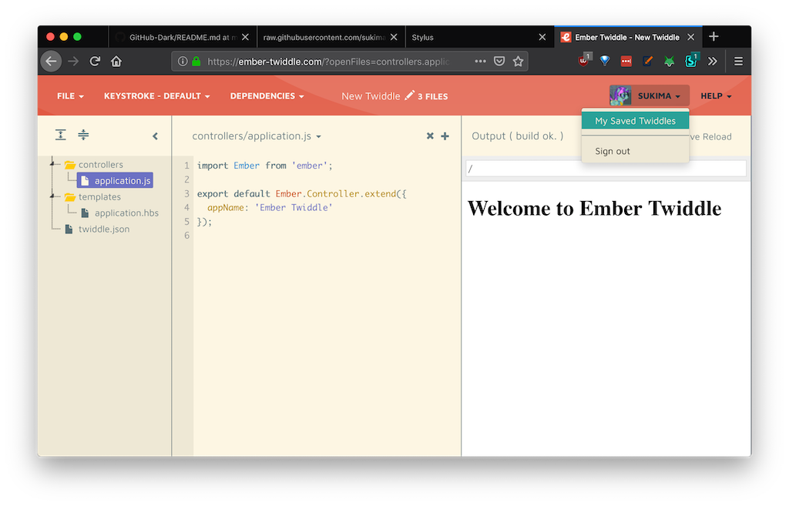

# Solarized Theme for Ember Twiddle

A UserCSS Solarized theme for [ember-twiddle.com](https://ember-twiddle.com) :bow: :heart: :eyes:

## Installation

Install [Stylus](https://add0n.com/stylus.html) for either [Firefox](https://addons.mozilla.org/en-US/firefox/addon/styl-us/), [Chrome](https://chrome.google.com/webstore/detail/stylus/clngdbkpkpeebahjckkjfobafhncgmne) or [Opera](https://addons.opera.com/en-gb/extensions/details/stylus/) and then install the style:

📦 [Install the usercss](https://raw.githubusercontent.com/sukima/ember-twiddle-solarized/master/ember-twiddle-solarized.user.css) which supports automatic updates and customization.

## Screenshots

